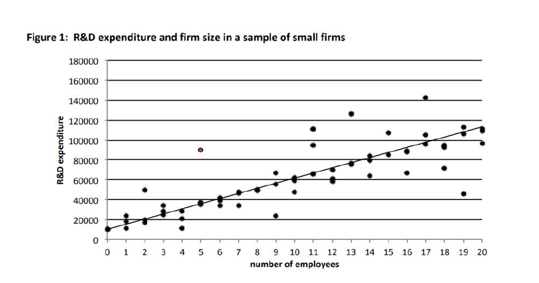

# Regresná analýza

## Účel

Regresia je spôsob, ako zosumarizovať priamy vzťah medzi výslednými
efektami a súborom vysvetľujúcich premenných, pričom pre každú
vysvetľujúcu premennú sa počíta jej „čistý dopad" pri vysvetľovaní a
predpovedaní výsledku (bez vplyvu všetkých ďalších premenných). Zaujíma
nás najmä špeciálny prípad, v ktorom jedna z týchto vysvetľujúcich
premenných predstavuje politiku, ktorú chceme vyhodnotiť. Riešime vplyv
tejto premennej na výsledok, zatiaľ čo ostatné premenné sú v pozadí. Ak
by sme ich vynechali z regresie, mohlo by to skresliť odhady dopadu.

Typické vysvetlenie regresie v učebniciach začína grafickým znázornením
vzťahu medzi dvoma premennými ako je napr. spotreba potravín a príjem,
alebo príjem a roky vzdelávania a pod. Údaje sú znázornené bodmi v
dvojrozmernom priestore. (Lineárny) vzťah medzi dvoma premennými je
reprezentovaný čiarou prechádzajúcou bodmi. Príklad je na obrázku 1,
ktorý sa zameriava na výdavky na výskum a vývoj a veľkosťou firmy podľa
počtu zamestnancov. Ako by sme mali interpretovať sklon takejto
regresnej priamky? Sklon predstavuje zmenu, ktorú v priemere pozorujeme
v závislej premennej (výdavky na výskum a vývoj) pri jednotkovej zmene
nezávislej premennej (v tomto prípade jedného ďalšieho zamestnanca).

Zatiaľ sa nezaoberáme príčinnými vzťahmi, chceme urobiť jednoduchú
predpoveď: „Akú úroveň výdavkov na výskum a vývoj očakávame od firmy s N
zamestnancami?" Môže to byť užitočné napríklad pre daňový úrad, keď si
podniky môžu nárokovať daňový odpočet za výdavky na výskum a vývoj.
Daňový úrad tak môže vykonať špeciálny prieskum na zber údajov o vzťahu
medzi veľkosťou firmy a výdavkami na výskum a vývoj, a potom výšku
odpočtu predpovedať pre akúkoľvek firmu podľa počtu zamestnancov. Na
zvislej osi y máme výdavky (závislú premennú) a na vodorovnej osi x máme
počet zamestnancov (nezávislú premennú). Napr. pre firmy s 5
zamestnancami sa výdavky hýbu v rozmedzí od 40 -- 80 tis. EUR, kým pre
firmy s 19 zamestnancami to je okolo 40 -- 140 tis. EUR. Tento interval
je okrem veľkosti firmy daný aj inými faktormi; niektoré z nich je možné
sledovať. 

{width="500px"}

Vzťah medzi dvoma
premennými na obrázku 1 je priamoúmerný a regresná priamka sa dá popísať
matematickou rovnicou. Tá znamená, že firma s nula zamestnancami
vynaloží na VaV 10 000 EUR a každý ďalší zamestnanec by mal predstavovať
náklad ďalších 5 000 EUR:

Očakávané výdavky na výskum a vývoj $=$ 10 000 $+$ 5 000 $\times$ počet
zamestnancov

Očakáva sa, že firmy s nulovým počtom zamestnancov vynaložia 10 000 EUR
na výskum a vývoj. Môžeme teda odhadnúť, že firmy so 17 zamestnancami
vynaložia na výskum a vývoj v priemere 95 000 EUR.

Na základe dostupných údajov nemôžeme s istotou tvrdiť, že existuje
kauzálny vzťah medzi týmito dvoma premennými: nevieme, či počet
zamestnancov stimuluje úroveň výdavkov na výskum a vývoj; alebo či je
rast pracovnej sily dôsledkom výskumu a vývoja; alebo či existuje tretia
premenná, napríklad sektor, v ktorom firma pôsobí, ktorý vplýva na rast
pracovných síl, ako aj výdavky na výskum a vývoj. Môžeme len povedať, že
medzi týmito dvoma premennými existuje súvislosť, že sú pozitívne
korelované. Korelácia však neznamená kauzalitu. Keďže sme nezistili
kauzálnu súvislosť, nemôžeme povedať, že zvýšime výdavky firiem na
výskum a vývoj (VaV) tým, že ich prinútime zvýšiť počet zamestnancov.

*Vplyv grantov na VaV výdavky*

Môžeme chcieť merať dopad/vplyv - v zmysle kauzálneho účinku. Malým a
stredným podnikom (MSP) poskytneme dotácie s cieľom zvýšiť ich výdavky
na výskum a vývoj. Chceli by sme vedieť aký je vplyv grantu na VaV
výdavky. Predpokladajme, že výška grantu je stanovená na 16 000 EUR.
Údaje ukazujú rozdiel vo výške 25 000 EUR medzi priemernými VaV
výdavkami firiem, ktoré požiadali o grant (100 000 EUR), a tými, ktoré
ich neposkytli (75 000 EUR). Na základe týchto údajov nemôžeme
konštatovať, že grant spôsobuje zvýšenie výdavkov o 25 000 EUR. Je to
priemerný rozdiel spojený s čerpaním grantu, ale nemôžeme tvrdiť, že je
spôsobený grantom. Je pravdepodobné, že spoločnosti, ktoré žiadajú
o grant budú mať vyššie VaV výdavky aj v prípade absencie grantu. Už to,
ktoré firmy žiadajú o grant by pravdepodobne viedlo k rozdielom vo VaV
výdavkoch, aj keby granty nikdy neboli vyplatené. Tieto rozdiely v
charakteristikách pred intervenciou označujeme ako tzv. skreslenie
výberu.

*Výberové skreslenie*

Dochádza k nemu, keď je účasť na intervencii dobrovoľná. Firmy, ktoré do
VaV investujú viac budú o grant pravdepodobne žiadať viac ako iné.
Reálny efekt grantu tak bude pravdepodobne oveľa menší ako pozorovaných
25 000 Eur. Pozorované rozdiely sú súčtom skutočného efektu grantu
a výberového skreslenia. Pozorovaný rozdiel sa najviac približuje k
skutočným efektom, ak by boli granty pridelené firmám náhodne. Ak nie je
možné pracovať s náhodným výberom, potom je nutné použiť niektorú
z kvázi-experimentálnych metód[^11-regresia-1]. Regresia je typická
neexperimentálna metóda. Tento problém však môžeme riešiť viacnásobnou
regresiou.

[^11-regresia-1]: experimentálne metódy využívajú kontrolnú a testovaciu
    skupinu, pričom obe sú vytvorené náhodným výberom;
    kvázi-experimentálne metódy využívajú tiež porovnanie medzi
    kontrolnou a testovacou skupinou (bez intervencie a s intervenciou),
    ale tieto skupiny nie sú vytvorené náhodným výberom;
    neexperimentálne metódy pracujú len s testovacou skupinou

## Silné stránky a obmedzenia

Kvalitu regresie posudzujeme podľa dvoch parametrov. Prvý problém súvisí
s tým, do akej miery model vysvetľuje variabilitu závislej premennej.
Táto miera sa nazýva R\^2 a môže mať hodnotu od nuly do jednej. Čím
bližšie sú jednotlivé hodnoty k regresnej priamke, tým vyššia je hodnota
R\^2.

Štandardná odchýlka predstavuje variabilitu odhadu (ako regresný
koeficient alebo rozdiel medzi dvoma priemermi), ktorý by bolo možné
získať opakovanými vzorkami veľkosti N z rovnakej nekonečnej populácie.
Štandardné chyby hrajú ústrednú úlohu v štatistike, pretože kvantifikujú
neistotu. Kľúčovou myšlienkou je porovnať štatistiku získanú zo vzorky s
jej štandardnou odchýlkou. Veľmi častým pravidlom je, že (absolútna
hodnota) štatistiky by mala byť viac ako dvojnásobok štandardnej chyby.
Ak je táto podmienka splnená, usúdime, že účinok politiky je štatisticky
významný (to znamená, že nie je spôsobený náhodou).

Treba si pamätať, že:

-   štatistická významnosť (vyjadruje mieru pravdepodobnosti, že zistený
    výsledok platí pre základnú populáciu v danom pásme odchýlok), vôbec
    nepreukazuje, že sme identifikovali vzťah, ktorý je možné
    interpretovať ako kauzálny. Môžeme nájsť veľa príkladov, ktoré majú
    štatisticky významné, ale nelogické výsledky,

-   štatistická významnosť je do značnej miery ovplyvňovaná veľkosťou
    vzorky. Ako N rastie do nekonečna, všetky rozdiely sa stávajú
    významnými (aj preto pracujeme so vzorkou),

-   ak chceme posúdiť dopady bez ohľadu na štatistickú významnosť,
    najlepšie je porovnať dopady s nákladmi. V našom príklade bol
    konečný odhad dopadu 4 000 EUR - to znamená, že priemerný nárast VaV
    investícií u firiem, ktoré získali grant je 4 000 EUR, čo je veľmi
    málo ak je priemerný grant 16 000 EUR.

Regresnou analýzou nemôžeme úplne eliminovať problém výberového
skreslenia. Viacnásobná regresia je nástrojom na čiastočné riešenie
tohto problému. Riešenie poskytuje kombinácia s inými metódami (napr.
rozdiel rozdielov) alebo využite metódy Propensity Score Matching (PSM).
