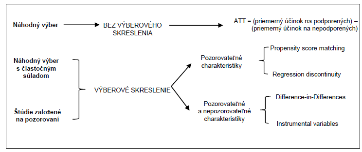

# (PART\*) Hodnotenie dopadov {-}
Jedným zo základov hodnotenia intervencií sociálno-ekonomického rozvoja
je kvantifikácia a vysvetlenie ich efektov. Aby mohli tvorcovia politík
prijímať informované rozhodnutia musia vedieť čo funguje a čo nefunguje,
ako, prečo, pre koho a v akom kontexte sa to deje. Otázok je veľa a
dostupné analytické metódy poskytujú len predbežné a neúplne odpovede na
väčšinu z nich. Preto je mimoriadne dôležité objasniť, ktoré metódy môžu
za akých okolností zodpovedať na ktoré otázky.

Pri posudzovaní efektov verejných politík sa zvyčajne objavujú dve
koncepčne odlišné skupiny otázok: jedna sa zaoberá predovšetkým
kvantifikáciou účinkov, druhá ich vysvetlením.

-   Sú to metódy zamerané predovšetkým na pochopenie toho, prečo
    intervencia spôsobuje zamýšľané a nezamýšľané účinky, pre koho a v
    akom kontexte. Cieľom je odpovedať na otázku „prečo to funguje?" na
    základe teórie zmeny intervencie a hodnotením jej úspechu tým, že
    porovnáme teóriu so skutočnou implementáciou;

-   a metódy určené predovšetkým na zistenie, či daná intervencia
    spôsobuje plánované efekty. Hlavným cieľom je odpovedať na otázku či
    „to robí nejaký rozdiel?" identifikovaním a odhadom kauzálnych
    efektov pomocou kontrafaktuálnych metód.

Chceme zdôrazniť pojem „predovšetkým". Identifikácia a odhad kauzálnych
účinkov si vyžaduje určitú teóriu, zatiaľ čo porovnanie teórie a
implementácie si vyžaduje určitú kvantifikáciu. To sú však dve odlišné
otázky.

*Atribúcia verzus príspevok*

Kauzálne otázky sú tie, ktoré „sa snažia porozumieť a posúdiť vzťahy
príčiny a následku (ako a do akej miery je to, čo sa stalo v dôsledku
intervencie?)". V tomto zmysle sa kauzalita sústreďuje na myšlienku
atribúcie. Napríklad, poskytnutie pomoci malým a stredným podnikom
zlepší ich prežitie alebo zmení ich náborové praktiky? Eliminujú
investície do novej dopravnej infraštruktúry prekážky a skracujú
cestovné časy? Cieľom týchto otázok je zistiť, či intervencia funguje;
ktoré intervencie majú požadované efekty? Alebo do akej miery sú
pozorované zmeny skutočne spôsobené intervenciou?

Bežne sa tzv. kontrafaktuálne hodnotenie (counterfactual impact
evaluation -- CIE)" považuje za vhodné pre „jednoduché" intervencie, kým
„hodnotenie založené na teórii (theory-based impact evaluation -- TBIE)"
pre komplexné intervencie, čo nie je správne. Jednoduché intervencie
projekty sú prvkami komplexných a otázka „či to funguje" môže byť jednou
časťou širšieho hodnotenia, ktoré zohľadňuje túto komplexnosť. Otázka
„prečo to funguje" je relevantná aj pre relatívne jednoduché intervencie
s jasnými cieľmi a mala by tu byť ľahšie zodpovedateľná. Predstava, že
komplexné situácie sú ľahko riešiteľné zložitými metódami, je jednoducho
nesprávna: komplexnosť je problémom pre všetky.

# Kontrafaktuálne hodnotenie dopadov

Skupiny otázok zaoberajúce sa kvantifikáciou účinkov sa riešia
kontrafaktuálnymi metódami. Posudzujú, či daná intervencia vyvolala
požadované efekty.

Táto časť popisuje jednotlivé kontrafaktuálne metódy, ktoré eliminujú
výberové skreslenie. Patria medzi ne: propensity score matching,
regression discontinuity design, či difference-in-differences.

Prvé dve metódy -- Propensity score matching a Regression discontinuity
design -- možno použiť, ak poznáme a máme údaje pre všetky premenné,
ktoré majú vplyv na potenciálne výsledky. Tento dodatočný predpoklad je
ťažko splniteľný v oblastiach ako vzdelávanie a trh práce, kde
nepozorovateľné charakteristiky (ako osobné schopnosti, motivácia a
inteligencia) budú s väčšou pravdepodobnosťou vplývať na individuálne
správanie. V prípadoch, keď hodnotiteľ predpokladá, že výber do
intervencie je ovplyvňovaný tak pozorovateľnými ako aj nepozorovateľnými
faktormi/ charakteristikami sú k dispozícii ďalšie metódy, okrem iného
napr, Difference-in-differences (rozdiel rozdielov).

{width="500px"}

## Propensity score matching

Metóda Propensity score matching (PSM) je založená na štatistickej
porovnávacej skupine ktorá je vytvorená na základe pravdepodobnosti
účasti na podpore (hodnote propensity score) za využitia pozorovateľných
charakteristík jednotiek populácie. Podporené jednotky sú následne
spárované s nepodporenými na základe hodnôt propensity score. Priemerný
účinok podpory sa následne vypočíta ako priemer rozdielov vo výsledkoch
naprieč týmito dvomi skupinami. Na párovanie podporených a nepodporených
jednotiek na základe propensity score sa využívajú rozličné postupy.

### Účel

Vzhľadom na kontroverzný charakter implementácie náhodných
(randomizovaných) hodnotení predstavuje tento prístup veľmi presné
hodnotenie dopadu. Teda ak intervencia nemôže byť implementovaná náhodne
je simulácia náhodného experimentu vhodným riešením. Hodnotiteľ sa
pomocou párovacích techník snaží vytvoriť kontrafaktuálnu / kontrolnú
skupinu, ktorá je vzhľadom na pozorovateľné charakteristiky čo
najpodobnejšia podporenej skupine. Podstatou je nájsť z čo najväčšej
skupiny nezúčastnených jednotiek také jednotky, ktoré sú pozorovateľne
podobné podporeným jednotkám v charakteristikách neovplyvnených účasťou
v intervencii (tieto môžu zahŕňať pred-intervenčné charakteristiky,
keďže tieto s určitosťou nie sú ovplyvnené následnou účasťou v
intervencii). Každá podporená jednotka je spárovaná s podobnou
nepodporenou jednotkou a priemerný rozdiel vo výsledkoch naprieč týmito
dvomi skupinami je účinkom intervencie.

Za predpokladu že rozdiely v účasti sú založené výlučne na
pozorovateľných charakteristikách a ak máme k dispozícii dostatočne
veľkú skupinu nepodporených jednotiek na spárovanie s podporenými,
môžeme odmerať účinok podpory. Pri aplikácii PSM je každá podporená
jednotka spárovaná s nepodporenou na základe jej hodnoty propensity
score, odrážajúcej pravdepodobnosť podpory podmienenú rozličnými
pozorovateľnými charakteristikami X.

Pri aplikácii metódy PSM sa zostrojí štatistická porovnávacia skupina
modelovaním pravdepodobnosti účasti v intervencii na základe
pozorovateľných charakteristík neovplyvnených intevenciou. Podporení sú
následne spárovaní s nepodporenými na základe tejto pravdepodobnosti,
tzn. hodnoty *propensity score*. Priemerný účinok podpory sa vyráta ako
rozdiel priemerných hodnôt výsledkov týchto dvoch skupín.

Sama o sebe je metóda PSM užitočná v prípadoch ak sa má za to, že účasť
na intervencii určujú iba pozorovateľné charakteristiky. Tento
predpoklad závisí od pravidiel cielenia intervencie, ako aj od faktorov
vedúcich k prihláseniu sa jednotiek do intervencie (self-selection). V
ideálnom prípade, ak sú pre podporené a nepodporené jednotky dostupné
dáta z obdobia pred implementáciou intervencie, môžu sa využiť na
výpočet hodnôt *propensity score* a spárovanie týchto dvoch skupín na
ich základe.

### Podmienky použitia

Kľúčovou podmienkou použiteľnosti porovnávania je dostupnosť
charakteristík (premenných) pozorovaných pred intervenciou. Premenné
pozorované po intervencii môžu byť ovplyvnené samotnou intervenciou. V
ideálnom prípade by všetky premenné, ktoré ovplyvňujú výberový proces,
mali byť zahrnuté do zoznamu porovnateľných premenných, aj keď je to
zriedka. Ďalšou podmienkou správneho uplatňovania porovnávania je
existencia podstatného prekrývania medzi charakteristikami podporených
a nepodporených. Z porovnania by mali byť vylúčení tí, ktorí nie sú
podporení a majú veľmi nízke skóre alebo podporení s veľmi vysokým
skóre.

### Hlavné kroky

Na výpočet účinkov intervencie je najprv potrebné vyrátať hodnoty
propensity score na základe všetkých pozorovateľných charakteristík,
ktoré ovplyvňujú tak účasť v intervencii ako aj očakávaný výsledok.
Cieľom párovania je vytvorenie čo možno najpodobnejšej porovnávacej
skupiny nezúčastnených jednotiek k skupine podporených jednotiek.

*1. Stanovenie hodnoty propensity score*

Hodnota propensity score určuje pravdepodobnosť jednotky v cieľovej
populácii (podporené a porovnávacie jednotky), že získa podporu
(treatment) na základe jej pozorovateľných charakteristík. Ak majú dve
jednotky podobnú hodnotu propensity score, znamená to že sú podobné aj v
charakteristikách použitých na jej určenie.

*2. Kontrola spoločnej oblasti prelínania*

Je potrebné zabrániť porovnávaniu neporovnateľného, tzn. že v analýze by
sa mala použiť iba podmnožina porovnávacej skupiny ktorá je porovnateľná
s podporenou skupinou. Je potrebné skontrolovať výskyt aspoň jednej
podporenej a jednej nepodporenej jednotky pre každú z hodnôt propensity
score. Existuje viacero metód kontroly avšak najjednoduchšou je vizuálna
analýza hustoty rozloženia hodnôt propensity score. Ďalšou možnosťou je
porovnanie miním a maxím hodnôt propensity score v podporenej a
nepodporenej skupine. Oba prístupy vyžadujú odstránenie všetkých
pozorovaní pri ktorých je hodnota propensity score menšia ako minimum
alebo väčšia ako maximum v druhej skupine.

*3. Voľba algoritmu párovania*

Ďalší krok sa pozostáva zo spárovania podporených a nepodporených
jednotiek, ktoré majú podobné hodnoty propensity score za použitia
vhodného algoritmu párovania. Algoritmy párovania sa líšia v spôsobe
merania podobnosti medzi podporenými a nepodporenými jednotkami (tzn.
spôsobe akým sa tvoria dvojičky) a tiež v spôsobe prideľovania váh
spárovaným jednotkám.

*4. Presnosť (kvalita) párovania*

Kvalita párovania sa hodnotí na základe jeho schopnosti vyvážiť
porovnávaciu a podporenú skupinu s ohľadom na charakteristiky použité
pri určení hodnôt propensity score. Existuje viacero spôsobov hodnotenia
kvality párovania. Základnou myšlienkou všetkých prístupov je porovnať
rozloženie premenných (jednotlivých charakteristík) v oboch skupinách
(podporenej a porovnávacej) pred a po párovaní na základe propensity
score. V prípade významných rozdielov po párovaní nebolo párovanie na
základe hodnôt propensity score úplne úspešné a je potrebné vykonať
určité nápravné opatrenia. Dobrá párovacia procedúra by mala znížiť
štandardnú odchýlku (skreslenie) pre každú variabilnú premennú
(pozorovateľnú charakteristiku) použitú pri určení propensity score.
Tento prístup vyžaduje porovnanie štandardných odchýlok pre každú
variabilnú premennú pred a po párovaní.

*5. Odhad účinkov podpory*

Po spárovaní podporených jednotiek s jednotkami kontrolnej skupiny je
určenie účinkov podpory relatívne jednoduché -- postačuje vyrátať
priemernú hodnotu rozdielu medzi výsledkovou premennou v podporenej a
nepodporenej skupine.

### Silné stránky a obmedzenia

Párovanie má dve jasné nevýhody v porovnaní s experimentálnymi
technikami. Prvou je predpoklad podmienenej nezávislosti - to znamená,
že výberové skreslenie je eliminované kontrolou premenných. V prípade
správneho náhodného výberu si môžeme byť istí, že populácia podporených
a nepodporených nie je rovnaká, pokiaľ ide o pozorovateľné aj skryté
charakteristiky. Po druhé, zatiaľ čo pri porovnávaní sa dajú odhadnúť
účinky intervencie iba v prípade, že dôjde k prekrývaniu medzi
populáciou podporených a nepodporených; náhodným priradením sa zabezpečí
spoločná (ne)podpora v celej vzorke. Vďaka týmto úvahám sú
experimentálne techniky jednoznačne lepšie ako porovnávanie. Pri
navrhovaní a výkone hodnotení intervencií sú však dôležité aj praktické
úvahy ako často sa dajú experimentálne prístupy použiť.

Hlavnou výhodou porovnávania oproti náhodnému priradeniu je to, že sa
vyhýba etickým úvahám, ktoré vznikajú, keď sa náhodne zamietne
potenciálne prospešná liečba. Náklady sú tiež dôležitým praktickým
aspektom pri vykonávaní hodnotení. V niektorých prípadoch, napriek
náročným požiadavkám na porovnávanie údajov, môže byť generovanie údajov
menej nákladné ako v prípade experimentu, pretože tento experiment
vyžaduje dôkladné monitorovanie náhodného výberu.

## Regression Discontinuity Design (RDD)

Metóda Regression Discontinuity Design (RDD) má viacero prvkov náhodného
experimentu a môže byť použitá v prípadoch, kedy náhodný výber
podporených a nepodporených nie je možný. Ide o populárnu
kvázi-experimentálnu metódu, ktorá je založená na poznaní presných
pravidiel na základe ktorých je stanovená oprávnenosť zúčastniť sa
intervencie. V súlade s touto metódou je zaradenie uchádzačov do
oprávnenej skupiny založené výlučne na pozorovateľných
pred-intervenčných premenných a pravdepodobnosť podpory sa nespojito
mení ako funkcia týchto premenných. Pre objasnenie tejto myšlienky
môžeme uviesť príklad, v ktorom je skupina žiadateľov o podporu
rozdelená do dvoch skupín podľa hodnoty zvolenej premennej v
pred-intervenčnom období (napr. vek, výška mzdy, počet bodov z odborného
hodnotenia). Žiadatelia nachádzajúcim sa nad určitou hranicou sa
zúčastňujú na intervencii, zatiaľ čo žiadatelia nachádzajúci sa pod
touto hranicou nie sú zapojení. Nespojitosť v rámci RDD môže byť
***sharp*** (ostrá) alebo ***fuzzy*** („rozmazaná").

{width="500px"}

Hlavnou myšlienkou tejto metódy je, že jednotky v cieľovej populácii pod
stanovenou hranicou (ktorí neboli podporení) sú vhodnou porovnávacou
skupinou k jednotkám nad touto hranicou (ktorí boli podporení). Účinok
intervencie je možné určiť porovnaním priemerných výsledkov podporených
žiadateľov nachádzajúcich sa tesne nad hranicou oprávnenosti so
zamietnutými žiadateľmi nachádzajúcimi sa tesne pod hranicou
oprávnenosti. Oblasť v okolí hranice sa dá za určitých podmienok
porovnateľnosti označiť takmer ako náhodný experiment.

Z uvedeného vyplýva, že *sharp RDD* zachytáva účinok intervencie iba na
podskupine populácie s hodnotami blízko hranice. V prípade heterogénnych
účinkov intervencie sa môže lokálny priemerný účinok podpory značne
líšiť od účinkov podpory na jednotky nachádzajúce sa vo väčšej
vzdialenosti od hranice. Hoci je tento prístup charakterizovaný vysokou
internou validitou, jeho výsledky nemôžu byť vždy generalizované na celú
cieľovú populáciu.

### Podmienky použitia

Táto metóda musí spĺňať niekoľko podmienok, aby bola úplne použiteľná. V
prvom rade musí byť výber určený na základe pozície voči hranici.
Príklad administratívnych pravidiel tohto druhu nie je neobvyklý: okrem
charakteristík ako sú príjmy domácnosti alebo veľkosť firiem, je možné
uvažovať o rebríčkoch, ktoré sledujú napríklad dĺžku (ne)zamestnanosti.
Ďalším obmedzením uplatniteľnosti RDD je to, že jednotlivci by nemali
mať možnosť manipulovať so svojou pozíciou vzhľadom na hraničnú hodnotu,
kvôli tomu aby sa mohli zúčastňovať na intervencii.

### Hlavné kroky

*1. Stanovenie výberovej premennej a hraničnej hodnoty*

Podmienkou aplikácie metódy RDD je existencia spojitej výberovej
premennej s hranicou rozdeľujúcou jednotky do podporenej a nepodporenej
skupiny.

*2. Stanovenie intervalu okolo hranice*

Stanovenie oblasti okolo hraničnej hodnoty závisí na hodnotiteľoch a
početnosti pozorovaní. Zvyčajne sa aplikuje princíp viacerých
intervalov, napr. veľký interval (0% $< x <$ 50%), stredný interval (10%
$< x <$ 40%) a malý interval (15% $< x <$ 35%). V tejto súvislosti je
potrebné poznamenať, že čím je interval menší, tým viac sú podmienky
podobné experimentálnemu postupu. Na druhej strane však platí, že čím je
interval menší, tým je menšia aj externá validita výsledkov analýzy,
keďže sa porovnáva len časť populácie ktorá sa nachádza v blízkosti
danej hranice.

*3. Určenie typu nespojitosti (sharp alebo fuzzy)*

Pri sharp regression discontinuity je podpora deterministickou funkciou
kovariantu. Pri fuzzy regression discontinuity sa využívajú nespojitosti
v pravdepodobnosti podpory závislé na kovariante. Nespojitosť je
následne použitá ako inštrumentálna premenná.

*4. Odhad účinkov*

Odhad účinkov sa vykoná využitím regresného modelu. Regresia sa môže
vykonať pre všetky zvolené intervaly.

*5. Analýza externej validity odhadu účinkov*

V prípade heterogénnych účinkov intervencie umožňuje metóda RDD iba
identifikáciu priemerného dopadu v oblasti hranice výberu. V reálnej
situácii, pri výskyte heterogénnych účinkov naprieč podporenými
jednotkami môže byť lokálny účinok podpory značne odlišný od účinku v
oblasti vzdialenejšej od hranice výberu. Z tohto dôvodu by sa mali
hodnotitelia uistiť, či a za akých podmienok sú výsledky v okolí hranice
zovšeobecniteľné na celú populáciu.

### Silné stránky a obmedzenia

Tento návrh umožňuje identifikovať kauzálny efekt intervencie bez
umelých vylúčení, predpokladov týkajúcich sa výberu, formulárov a pod..
RDD môže byť najlepšou alternatívou k randomizovaným štúdiám na
hodnotenie efektívnosti intervencií. Najdôležitejším prvkom návrhu RDD
je použitie hraničného skóre pred intervenciou na rozdelenie do skupín
(s intervenciou a bez). Výhodou je, že to, na základe čoho sa robí
rozdelenie, nemusí byť rovnaké ako výsledný efekt.

Na druhej strane má dizajn dve hlavné obmedzenia. Po prvé, jeho
uskutočniteľnosť sa z definície obmedzuje na tie prípady, v ktorých sa
výber uskutočňuje na základe premennej pozorovateľnej pred intervenciou.
V skutočnosti tomu tak často nie je. Po druhé, aj keď je prístup
uskutočniteľný, identifikuje iba priemerný vplyv na hranici. To nám v
prítomnosti heterogénnych vplyvov nehovorí nič o vplyve na jednotky mimo
hranice. V tomto zmysle identifikujeme iba lokálny dopad intervencie. Na
identifikáciu dopadu na širšiu populáciu sa dá použiť iba
neexperimentálny odhad.

## Rozdiel rozdielov

Metóda rozdiel rozdielov -- Difference-in-Differences (DD -- *double
difference*) využíva časové rady údajov na určenie kontrafaktuálnej
situácie. Jej aplikácia si vyžaduje údaje pre podporenú aj nepodporenú
skupinu a to pre obdobie pred aj po realizácii intervencie. Výsledný
efekt vypočíta ako rozdielov výsledkov medzi podporenou a porovnávacou
skupinou po určitom čase od ukončenia realizácie intervencie, v
porovnaní s ich rozdielom v období pred intervenciou. Účinky sa získajú
odpočítaním rozdielu pred intervenciou vo výsledkoch medzi príjemcami a
osobami, ktoré nie sú príjemcami pomoci, od rozdielu po zásahu.

### Účel

Dopady intervencie sa dajú odhadnúť pomocou výpočtu dvojitého rozdielu,
jedného za čas (pred a po) a druhého medzi subjektmi (medzi podporenými
a nepodporenými). Táto metóda vo svojej najjednoduchšej podobe vyžaduje
iba súhrnné údaje o výslednej premennej. Ak sú k dispozícii údaje za
podporených aj nepodporených najmenej počas dvoch časových období,
metóda rozdiel rozdielov (DD) vytvára odhad dopadov, ktoré sú v zásade
pravdepodobnejšie ako dopady založené na jedinom rozdiele (buď v čase,
alebo medzi skupinami).

Najjednoduchší odhad dopadu je rozdielom vo výsledkoch medzi podporenými
a nepodporenými, ktorý sa meria po uskutočnení intervencie (napríklad
rozdiel v priemernej zamestnanosti medzi podporovanými a nepodporovanými
MSP, rok po poskytnutí podpory). Tento rozdiel však nie je dopadom
intervencie, pretože podporení majú tendenciu sa líšiť od tých, ktorí
nie sú podporení, čo je dôsledkom výberového skreslenia. Teraz
predpokladajme, že pred uskutočnením intervencie máme k dispozícii údaje
o výslednej premennej pre podporených aj nepodporených. Odčítanie
rozdielu pred intervenciou od rozdielu po intervencii eliminuje jeden
druh výberového skreslenia súvisiaci s časovo nemennými individuálnymi
charakteristikami. Inými slovami, ak sa rozlíšenie medzi podporenými a
nepodporenými nemení v čase, odpočítanie rozdielov pred intervenciou
odstráni výberové skreslenie a stanoví vierohodný odhad dopadu
intervencie.

### Podmienky použitia

Použitie metódy DD je podmienené efektom, ktorý sa opakuje v čase. To
znamená, že rovnaké merania sa môžu robiť opakovane v čase. Väčšina
efektov verejnej politiky sa dá časom replikovať pre tie isté jednotky
-- napr. tržby alebo zisky firiem, príjmy jednotlivcov alebo spotreba
domácností. Niektoré efekty sa prejavia len pre určitú jednotku,
napríklad trvanie nezamestnanosti po strate zamestnania alebo hmotnosť
detí pri narodení. V týchto prípadoch je lepšie pracovať napr. so
skupinami jednotlivcov,, ktorí sa stali nezamestnanými a takto odhadnúť
priemernú dobu nezamestnanosti.

Problémom, ktorý sa týka uplatniteľnosti DD dostupnosť údajov.
Štatistiky niektoré údaje zberajú na pravidelnej báze. Absencia údajov
pred intervenciou môže byť závažnou prekážkou uplatniteľnosti DD.
Retrospektívne meranie údajov je veľmi problematické. Uplatniteľnosť
tejto metódy si tiež vyžaduje, aby intervencia bola diskrétnej
(binárnej) povahy: musí existovať skupina s intervenciou a bez
intervencie.

### Hlavné kroky

*1. Výber premennej*

Analýza sa bude realizovať s akoukoľvek relevantnou premennou ku ktorej
existujú údaje. Napr. môžeme sledovať ročný prírastok príjmu na
obyvateľa.

*2. Výber obdobia pred a po intervencii*

Výber pred a po intervenčného obdobia závisí od dostupnosti údajov za
jednotlivé roky. Neexistuje univerzálne pravidlo na stanovenie presného
počtu rokov ktoré je potrebné sledovať pred intervenciou, resp. po jej
implementácii. Je potrebné zohľadniť charakter intervencie a dĺžku
obdobia jej implementácie.

Pri jednorazových opatreniach, resp. opatreniach nenáročných na
implementáciu (napr. nákup technológie, investícia do produkčných
zariadení) je postačujúce sledovať obdobie dvoch alebo troch rokov pred
realizáciou intervencie a obdobie po intervencii, kedy sa dá logicky
predpokladať že jej účinky sa už stihli prejaviť. Pri intervenciách
majúcich za cieľ zmeny menej hmatateľných oblastí (ako napr. zvýšenie
životnej úrovne, sociálneho a ekonomického postavenia, rodovej rovnosti,
alebo zlepšenie životného prostredia) je potrebné počítať s dlhšími
obdobiami počas ktorých sa bude pôsobenie intervencie sledovať a
vyhodnocovať.

*3. Odhad účinkov podpory*

Priemerný účinok podpory na podporených sa zvyčajne odhaduje
prostredníctvom regresnej analýzy. Základná analýza je jednoducho
záležitosťou výpočtu priemerov pre dve skupiny v dvoch časových
obdobiach (Tab. 3)

| Obce                    | zmena v príjme na osobu (%) |           | Rozdiel medzi obdobiami |
|------------------|:------------------:|:----------------:|:----------------:|
|                         |          1990 - 95          | 1995 - 99 |                         |
| s intervenciou          |            2,35             |   4,45    |          2,10           |
| bez intervencie         |            2,28             |   5,08    |          2,80           |
| rozdiel medzi skupinami |            0,07             |   -0,63   |        **-0,70**        |

: Tab. 3 DD odhad efektu podpory -- zmena príjmu na osobu

Z Tab. 3 je evidentné, že v období rokov 1995 až 1999 boli obce, ktoré
dostali podporu, podstatne menej úspešné v porovnaní s obcami, ktoré
nedostali podporu (o 0,7 % bodu bol nárast príjmu na osobu menší).

### Silné stránky a obmedzenia

Napriek svojej širokej uplatniteľnosti nie je metóda DD univerzálnou.
Jej pozitívnou stránkou je, že nevyžaduje zložité údaje, ale len súhrnné
údaje o výsledných efektoch politiky zozbierané pred a po intervencii.
Uplatnenie v praxi prináša niekedy určité obmedzenia.
